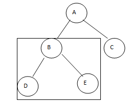

# BinaryTree

## Intro

A tree is a popular data structure that is non-linear in nature. Unlike other data structures like array, stack, queue, and linked list which are linear in nature, a tree represents a hierarchical structure. The ordering information of a tree is not important. A tree contains nodes and 2 pointers. These two pointers are the left child and the right child of the parent node. 
  - Root: The root of a tree is the topmost node of the tree that has no parent node. There is only one root node in every tree. 
  - Edge: Edge acts as a link between the parent node and the child node.
  - Leaf: A node that has no child is known as the leaf node. It is the last node of the tree. There can be multiple leaf nodes in a tree.
  - Subtree: The subtree of a node is the tree considering that particular node as the root node.
  - Depth: The depth of the node is the distance from the root node to that particular node.
  - Height: The height of the node is the distance from that node to the deepest node of that subtree.
  - Height of tree: The Height of the tree is the maximum height of any node. This is same as the height of root node.

Why would a programmer want to uses trees. Well, here are a few reasons:
  - One reason to use trees might be because you want to store information that naturally forms a hierarchy. 
  - Trees (with some ordering e.g., BST) provide moderate access/search (quicker than Linked List and slower than arrays). 
  - Trees provide moderate insertion/deletion (quicker than Arrays and slower than Unordered Linked Lists). 
  - Like Linked Lists and unlike Arrays, Trees don’t have an upper limit on the number of nodes as nodes are linked using pointers.

## How do Binary Trees Work

